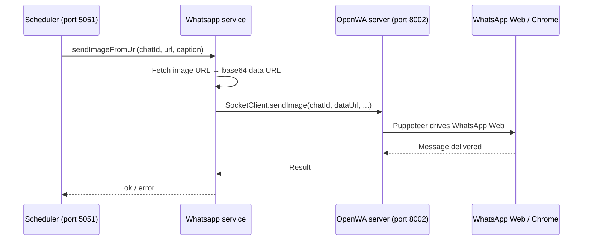

# OpenWA integration guide

This project uses [@open-wa/wa-automate](https://docs.openwa.dev/) to control WhatsApp Web (send images, list groups). OpenWA does **not** run inside the Express app. It runs as its own **local server** on a **different port**, and the API connects to it over the network (localhost).

---

## Two processes, two ports

| Process | Command | Default port | Role |
|---------|---------|--------------|------|
| **OpenWA server** | `npm run wa:server` | **8002** | Chrome + WhatsApp Web session, QR login, actual message sending |
| **Express API** | `npm run dev` | **5051** | REST API, MongoDB, cron schedulers — *asks* OpenWA to send messages |

```text
┌─────────────────────────────┐         socket / HTTP          ┌──────────────────────────────┐
│  Terminal 1                 │  ◄──────────────────────────►  │  Terminal 2                  │
│  npm run wa:server          │      localhost:8002            │  npm run dev                 │
│                             │      + API key                 │                              │
│  • Puppeteer + Chrome       │                                │  • Express (port 5051)       │
│  • WhatsApp Web logged in   │                                │  • Scheduler (node-cron)     │
│  • OpenWA EASY API          │                                │  • SocketClient → OpenWA     │
│  • Session files on disk    │                                │  • MongoDB                   │
└─────────────────────────────┘                                └──────────────────────────────┘
         │                                                                  │
         │  WhatsApp servers                                                │  Your HTTP clients
         ▼                                                                  ▼  (Postman, app, etc.)
```

### Why a different port?

OpenWA’s built-in server (`@open-wa/wa-automate/bin/server.js`) is designed to expose:

- An **HTTP API** and **WebSocket/socket** interface on one port (default **8002**).
- A small **Swagger UI** at `http://localhost:8002` for testing OpenWA calls directly.

Your automation API is a **separate Express application** on **5051** (`PORT` in `.env.dev`). It cannot share the same port without conflicting.

So:

- **8002** = WhatsApp engine (OpenWA).
- **5051** = your business API (groups, schedules, photos in MongoDB).

Both can run on the same machine; they are different programs listening on different ports.

### Why a separate process (not inside `npm run dev`)?

During development, `npm run dev` uses **nodemon**, which **restarts Node** whenever you change a controller, service, or config file.

If WhatsApp ran in the same process:

1. You save a file → nodemon restarts → **Chrome/WhatsApp session is killed**.
2. You must **scan the QR code again**.
3. Scheduled sends fail until you log in again.

By running OpenWA in **Terminal 1** with plain `node` (`wa:server`, no nodemon):

- Terminal 2 can restart freely while you edit the API.
- WhatsApp stays logged in in Terminal 1.
- The API reconnects to `localhost:8002` after each restart.

That is the main architectural reason for the split.

---

## Step-by-step: first-time setup

### Step 1 — Install dependencies

```sh
npm install
```

`postinstall` runs **patch-package** to fix OpenWA’s Chrome user-agent handling (see [Patches](#patches) below).

### Step 2 — Configure environment

Copy `.sample.env` to `.env.dev`. Minimum for OpenWA:

```env
WA_ENABLED=true
WA_SERVER_URL=http://localhost:8002
WA_API_KEY=dev-api-key
WA_SERVER_PORT=8002
WA_SESSION_ID=whatsapp-automation-poc
```

| Variable | Must match | Purpose |
|----------|------------|---------|
| `WA_SERVER_URL` | Port in `WA_SERVER_PORT` | Where the API connects |
| `WA_API_KEY` | `-k` passed to OpenWA server | Simple auth between API and OpenWA |
| `WA_SESSION_ID` | Session folder name | Persists login under `_IGNORE_<sessionId>/` |
| `PORT` | — | Express only (5051), unrelated to OpenWA port |

### Step 3 — Start OpenWA (Terminal 1)

```sh
npm run wa:server
```

What happens internally (`wa/startServer.js`):

1. Loads `.env.dev`.
2. Finds **Google Chrome** (`utils/chromePath.js` or `WA_CHROME_PATH`).
3. Applies a **modern Chrome user-agent** (`utils/whatsappUserAgent.js`) so WhatsApp Web does not show “Chrome 85+” errors.
4. Spawns OpenWA’s server with:
   - `--socket` — enables socket client used by the API
   - `-p 8002` — port
   - `-k dev-api-key` — API key
   - `--headful` — visible Chrome window
   - `--keep-alive` — keep session alive
   - `-c wa/cli.config.json` — session/QR settings

5. Chrome opens → go to WhatsApp Web → **scan QR** (first time only).
6. Wait until the terminal shows the client is **ready** / connected.

**Leave this terminal open.** Do not run `wa:server` under nodemon.

QR wait is **unlimited** because `wa/cli.config.json` sets `"qrTimeout": 0` (number). Do **not** put `WA_QR_TIMEOUT=0` in `.env` — OpenWA mis-parses it and still times out at 60 seconds.

### Step 4 — Start the Express API (Terminal 2)

```sh
npm run dev
```

What happens internally (`services/Whatsapp.js`):

1. Reads `WA_SERVER_URL` and `WA_API_KEY` from config.
2. Calls `SocketClient.connect("http://localhost:8002", "dev-api-key")` with retries (up to ~60 seconds).
3. On success: `Connected to OpenWA server — WhatsApp ready for API requests`.
4. Exposes `Services.Whatsapp` to controllers and the scheduler.

If OpenWA is not running, the API still starts but WhatsApp operations return “not ready” until you start Terminal 1 and restart or `rs` nodemon.

### Step 5 — Verify connection

```http
GET http://localhost:5051/Automation/v1.0/whatsapp/connection-status
```

```json
{
  "ok": true,
  "ready": true,
  "mode": "remote",
  "serverUrl": "http://localhost:8002"
}
```

Optional: open `http://localhost:8002` in a browser for OpenWA’s own Swagger/docs (not your Automation API).

### Step 6 — Use the automation API

Discover groups on the account, register targets, create schedules — see [API.md](./API.md). Sending always goes through OpenWA in the end.

---

## How a scheduled send uses OpenWA



Relevant code paths:

| Step | File |
|------|------|
| Cron fires | `services/Scheduler.js` → `dispatchScheduler()` |
| Send image | `services/Whatsapp.js` → `sendImageFromUrl()` |
| Screenshot bytes → data URL | `utils/screenshotPayload.js` → `bufferToDataUrl()` |
| List groups | `utils/whatsappGroups.js` → `fetchWhatsAppGroups(client)` |
| HTTP routes | `controllers/Automation.js` |

---

## Project files involved

| Path | Purpose |
|------|---------|
| `wa/startServer.js` | Starts OpenWA as child process; sets Chrome path and env |
| `wa/cli.config.json` | OpenWA session: multi-device, `qrTimeout: 0`, auto-refresh |
| `services/Whatsapp.js` | **Socket client** — connects to OpenWA, send/list |
| `config/conf.js` | `serverUrl`, `apiKey`, `sessionId` for the API process |
| `utils/chromePath.js` | Resolve Chrome executable on Windows |
| `utils/whatsappUserAgent.js` | Set Puppeteer user-agent before OpenWA starts |
| `utils/screenshotPayload.js` | Parse upload / convert buffer for `sendImage` |
| `utils/whatsappGroups.js` | `getAllGroups` + fallback for listing `@g.us` chats |
| `patches/@open-wa+wa-automate+4.76.0.patch` | UA fix applied on `npm install` |
| `scripts/cleanWaSession.js` | `npm run wa:clean` — delete session to force new QR |

There is **no** embedded WhatsApp mode in this repo anymore; everything uses **remote** socket connection to port 8002.

---

## Session persistence

After the first QR scan, OpenWA stores session data under the project root, for example:

- `_IGNORE_whatsapp-automation-poc/` (folder)
- `whatsapp-automation-poc.data.json` (file)

Controlled by `WA_SESSION_ID`. Same session id → stay logged in across `wa:server` restarts.

To force a fresh login:

```sh
npm run wa:clean
npm run wa:server
```

---

## Patches

WhatsApp Web rejects outdated browser user-agents. This project:

1. Patches `@open-wa/wa-automate` via `patch-package` (see `patches/`).
2. Sets user-agent at runtime in `wa/startServer.js` via `applyWhatsappUserAgent()`.

If you see **“Chrome 85+”** in the WhatsApp browser window: run `npm run wa:clean`, then `npm run wa:server` again.

---

## Daily workflow (summary)

```text
1. Terminal 1:  npm run wa:server     → wait until WhatsApp ready
2. Terminal 2:  npm run dev           → wait until "Connected to OpenWA server"
3. Call APIs on port 5051             → schedules, sends, groups
4. Edit API code                      → nodemon restarts Terminal 2 only; Terminal 1 unchanged
```

Restart order after a full machine reboot:

1. `wa:server` first  
2. `dev` second  

---

## Troubleshooting

| Problem | What to do |
|---------|------------|
| `Could not connect to OpenWA server` | Start `npm run wa:server`; wait for ready; then `npm run dev` or `rs` in nodemon |
| QR keeps timing out | Use `wa/cli.config.json` for `qrTimeout`; remove `WA_QR_TIMEOUT=0` from `.env` |
| QR loop after scan | You restarted WhatsApp inside `dev` — use two terminals; only Terminal 1 runs OpenWA |
| `ready: false` on connection-status | OpenWA not up or still logging in |
| `GET /whatsapp/available-groups` returns `[]` | Open WhatsApp in the Chrome window from `wa:server` and open each group once; or register group manually with `chatId` |
| Sends skipped: `whatsapp_not_ready` | Fix Terminal 1 + connection-status first |
| Chrome not found | Install Chrome or set `WA_CHROME_PATH` in `.env.dev` |
| Port 8002 already in use | Stop old `wa:server` or change `WA_SERVER_PORT` and `WA_SERVER_URL` together |

---

## Related documentation

- [API.md](./API.md) — REST endpoints on port **5051**
- [README.md](../README.md) — quick start and troubleshooting
- [OpenWA docs](https://docs.openwa.dev/) — upstream library reference
